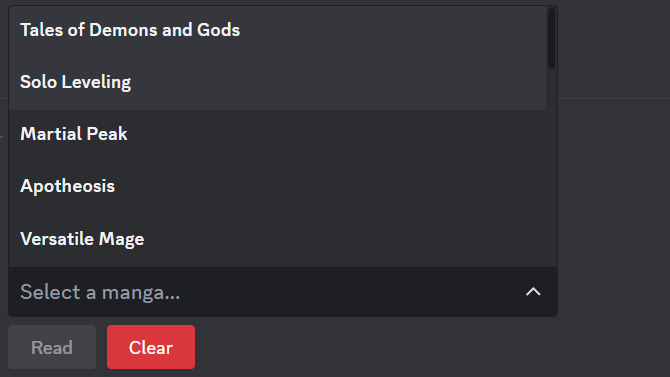

# Manga Bot

A simple bot written in python.

# Commands

/hot

/read

/search

# Sources

Currently supports the following sources:

    1. MangaBat: https://readmangabat.com
    2. MangaTown: https://m.mangatown.com  

# How to contribute

First you must create a scrapper driver in `modules` directory. You can look at the existing drivers (i.e. `modules/mangabat.py`).

Next. register the driver in `constants.py` in `sources` variable.

Thanks ✌️!!